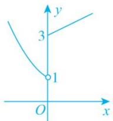
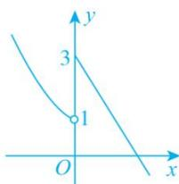

> [!faq]- 教师版对点训练解析
>
> > [!success]- **【答案】** C
>
> > [!note]- **【分析】**
> > 本题未单列分析。
>
> > [!note]- **【解析】**
> > 答案 C 解析 $\because f(f(x))-2=0,\quad\therefore f(f(x))=2,\quad\therefore f(x)=-1$ 或 $f(x)=-\frac{1}{k}(k\neq0)$ .
> > 
> > 图①
> > 
> > 图②
> > 
> > 图③
> > (1)当 k=0 时，作出函数 $f(x)$ 的图象如图①所示，由图象可知 $f(x)=-1$ 无解，∴ k=0 不符合题意；(2)当 k>0 时，作出函数 $f(x)$ 的图象如图②所示，由图象可知 $f(x)=-1$ 无解且 $f(x)=-\frac{1}{k}$ 无解，即 $f(f(x))-2=0$ 无解，不符合题意；(3)当 k<0 时，作出函数 $f(x)$ 的图象如图③所示，由图象可知 $f(x)=-1$ 有 1 个实根，∵ $f(f(x))-2=0$ 有 3 个实根，∴ $f(x)=-\frac{1}{k}$ 有 2 个实根，∴ $1<-\frac{1}{k}\leq3$ ，解得 $-1<k\leq-\frac{1}{3}$ 。综上，k 的取值范围是 $\left[-1,-\frac{1}{3}\right]$ ，
> >
> > 故选 **C**.
