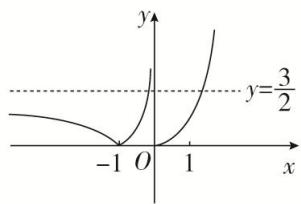
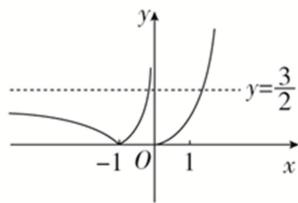

> [!faq]- 《专题18 函数的零点问题(5)-函数》例题解析
>
> > [!success]- **【答案】** 详见解析
>
> > [!note]- **【分析】**
> > 本题未单列分析。
>
> > [!note]- **【解析】**
> > 答案 5 解析 令 $y = 2f^2(x) - 3f(x) = 0$ ，则 $f(x) = 0$ 或 $f(x) = \frac{3}{2}$ . 函数 $f(x) = \begin{cases} x^3 & x \geq 0 \\ |\lg(-x)| & x < 0 \end{cases}$ 的图象如图所示：由图可得， $f(x) = 0$ 有 2 个根， $f(x) = \frac{3}{2}$ 有 3 个根，故函数 $y = 2f^2(x) - 3f(x)$ 的零点个数为 5.
> >
> > 
> >
> > 
