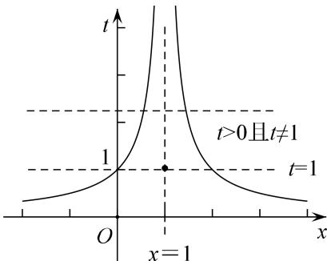

> [!faq]- 《专题18 函数的零点问题(5)-函数》例题解析
>
> > [!success]- **【答案】** 详见解析
>
> > [!note]- **【分析】**
> > 本题未单列分析。
>
> > [!note]- **【解析】**
> > 答案 5 解析 先作出 $f(x)$ 的图像如图，观察可发现对于任意的 $t$ ，满足 $t = f(x)$ 的 $x$ 的个数分别为 2 个 ( $t > 0, t \neq 1$ ) 和 3 个 ( $t = 1$ )，已知有 3 个解，从而可得 $f(x) = 1$ 必为 $f^2(x) + bf(x) + c = 0$ 的根，而另一根为 1 或者是负数。所以 $f(x_i) = 1$ ，可解得， $x_1 = 0, x_2 = 1, x_3 = 2$ 。所以 $x_1^2 + x_2^2 + x_3^2 = 5$ 。
> >
> > 
