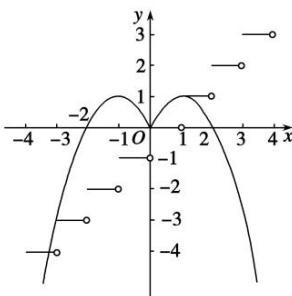

> [!faq]- 《专题18 函数的零点问题(5)-函数》例题解析
>
> > [!success]- **【答案】** D
>
> > [!note]- **【分析】**
> > 本题未单列分析。
>
> > [!note]- **【解析】**
> > 答案 D 解析 根据已知条件可知，当 $x > 0$ 时， $-x < 0$ ，又函数 $g(x)$ 的图象关于 $y$ 轴对称，故 $g(x)$ 为偶函数，所以 $g(x) = g(-x) = -(-x + 1)^2 + 1 = -(x - 1)^2 + 1$ . 由 $f(x) = [x]$ ，得 $f(f(x)) = [x]$ . 在同一平面直角坐标系中画出 $y = f(f(x))$ 与 $y = g(x)$ 的图象如图所示，由图象知，两个图象有4个交点，交点的纵坐标分别为1，0，-3，-4，当 $x \geq 0$ 时，方程 $f(f(x)) = g(x)$ 的解是0和1；当 $x < 0$ 时， $g(x) = -(x + 1)^2 + 1 = -3$ 得 $x = -3$ ，由 $g(x) = -(x + 1)^2 + 1 = -4$ 得 $x = -1 - \sqrt{5}$ . 综上， $f(f(x)) = g(x)$ 的解的个数为4.
> >
> > 
