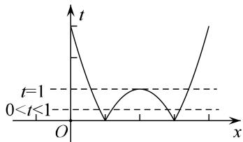

> [!faq]- 《专题18 函数的零点问题(5)-函数》例题解析
>
> > [!success]- **【答案】** A
>
> > [!note]- **【解析】**
> > 答案 B 解析 考虑通过图像变换作出 $t=f(x)$ 的图像（如图），因为 $[f(x)]^{2}+bf(x)+c=0$ 最多只能解出 2 个 $f(x)$ ，若要出七个根，则 $t_{1}=1,\quad t_{2}\in(0,1)$ ，所以 $-b=t_{1}+t_{2}\in(1,2)$ ，解得 $b\in(-2,-1)$ .
> >
> > 
