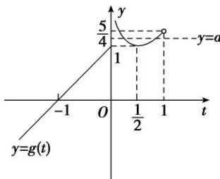

> [!faq]- 《专题18 函数的零点问题(5)-函数》例题解析
>
> > [!success]- **【答案】** 详见解析
>
> > [!note]- **【分析】**
> > 本题未单列分析。
>
> > [!note]- **【解析】**
> > 答案 $\left[1, \frac{5}{4}\right]$ 解析 令 $f(x)=t$ ，则原方程化为 $g(t)=a$ ，易知方程 $f(x)=t$ 在 $(-∞, 1)$ 上有 2 个不同的解，则原方程有 4 个解等价于函数 $y=g(t)(t<1)$ 与 $y=a$ 的图象有 2 个不同的交点，作出函数 $y=g(t)(t<1)$ 的图象如图，由图象可知，当 $1≤a<\frac{5}{4}$ 时，函数 $y=g(t)(t<1)$ 与 $y=a$ 有 2 个不同的交点，即所求 $a$ 的取值范围是 $\left[1, \frac{5}{4}\right]$ .
> >
> > 
> >
> > ## 【对点训练】
