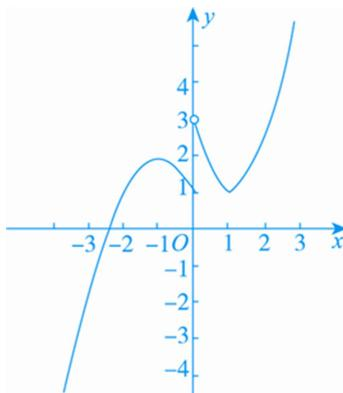

> [!faq]- 《专题18 函数的零点问题(5)-函数》例题解析
>
> > [!success]- **【答案】** C
>
> > [!note]- **【解析】**
> > 答案 C 解析 函数 $f(x)=\left\{\begin{aligned}&3^{|x^{-1}|},&x>0,\\&-x^{2}-2x+1,&x\leq0\end{aligned}\right.$ 的图象如图：
> >
> > 
> >
> > 关于 $x$ 的方程 $[f(x)]^2 + (a - 1)f(x) - a = 0$ 有7个不等的实数根，即 $[f(x) + a][f(x) - 1] = 0$ 有7个不等的实数根，易知 $f(x) = 1$ 有3个不等的实数根， $\therefore f(x) = -a$ 必须有4个不相等的实数根，由函数 $f(x)$ 的图象可知 $-a \in (1, 2)$ ， $\therefore a \in (-2, -1)$ .
> >
> > 故选 **C**.
