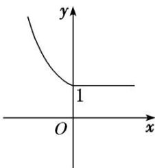

> [!faq]- 教师版例题解析
>
> > [!success]- **【答案】** (1) A；(2) A；(3) $\left(-\frac{1}{4}, +\infty\right)$；(4) C
>
> > [!note]- **【分析】**
> > 本题未单列分析。
>
> > [!note]- **【解析】**
> > 答案 A 解析 由题意可知 $f(x) = 2$ ，即 $\left\{ \begin{array}{l} 2^x = 2, \\ x \leq 0 \end{array} \right.$ 或 $\left\{ \begin{array}{l} |\log_2 x| = 2, \\ x > 0, \end{array} \right.$ 解得 $x = \frac{1}{4}$ 或 4. 故选 A.
> > 答案 A 解析 因为 $f(1) = \mathrm{e}^{1 - 1} = 1$ 且 $f(1) + f(a) = 2$ ，所以 $f(a) = 1$ ，当 $-1 < a < 0$ 时， $f(a) = \sin (\pi a^2) = 1$ ，因为 $0 < a^2 < 1$ ，所以 $0 < \pi a^2 < \pi$ ，所以 $\pi a^2 = \frac{\pi}{2} \Rightarrow a = -\frac{\sqrt{2}}{2}$ ；当 $a \geq 0$ 时， $f(a) = \mathrm{e}^{a - 1} = 1 \Rightarrow a = 1$ 。故 $a = -\frac{\sqrt{2}}{2}$ 或 1。
> > 答案 $\left(-\frac{1}{4}, +\infty\right)$ 解析 由题意知，可对不等式分 $x \leq 0$ ， $0 < x \leq \frac{1}{2}$ ， $x > \frac{1}{2}$ 讨论。
> > - **①**：当 $x \leq 0$ 时，原不等式为 $x + 1 + x + \frac{1}{2} > 1$ ，解得 $x > -\frac{1}{4}$ ，故 $-\frac{1}{4} < x \leq 0$ 。
> > - **②**：当 $0 < x \leq \frac{1}{2}$ 时，原不等式为 $2^x + x + \frac{1}{2} > 1$ ，显然成立。
> > - **③**：当 $x > \frac{1}{2}$ 时，原不等式为 $2^x + 2x - \frac{1}{2} > 1$ ，显然成立。综上可知，所求 $x$ 的取值范围是 $\left(-\frac{1}{4}, +\infty\right)$ 。
> > ## 答案 D 解析 法一：分类讨论法
> > - **①**：当 $\left\{ \begin{array}{l} x + 1 \leq 0, \\ 2x \leq 0, \end{array} \right.$ 即 $x \leq -1$ 时， $f(x + 1) < f(2x)$ ，即为 $2^{-(x + 1)} < 2^{-2x}$ ，即 $-(x + 1) < -2x$ ，解得 $x < 1$ 。因此不等式的解集为 $(- \infty, -1]$ 。
> > - **②**：当 $\left\{ \begin{array}{l} x + 1 \leq 0, \\ 2x > 0 \end{array} \right.$ 时，不等式组无解。
> > - **③**：当 $\left\{ \begin{array}{l} x + 1 > 0, \\ 2x \leq 0, \end{array} \right.$ 即 $-1 < x \leq 0$ 时， $f(x + 1) < f(2x)$ ，即为 $1 < 2^{-2x}$ ，解得 $x < 0$ 。因此不等式的解集为 $(-1, 0)$ 。
> > - **④**：当 $\left\{ \begin{array}{l} x + 1 > 0, \\ 2x > 0, \end{array} \right.$ 即 $x > 0$ 时， $f(x + 1) = 1$ ， $f(2x) = 1$ ，不合题意。综上，不等式 $f(x + 1) < f(2x)$ 的解集为 $(- \infty, 0)$ 。
> > 法二：数形结合法
> > $\because f(x) = \begin{cases} 2^{-x}, & x \leq 0, \\ 1, & x > 0, \end{cases}$ $\therefore$ 函数 $f(x)$ 的图象如图所示. 结合图象知, 要使 $f(x + 1) < f(2x)$ , 则需 $\begin{cases} x + 1 < 0, \\ 2x < 0, \\ 2x < x + 1 \end{cases}$ 或 $\begin{cases} x + 1 \geq 0, \\ 2x < 0, \end{cases}$ $\therefore x < 0$ , 故选 D.
> > 
> > 答案 C 解析 由 $f(f(a)) = 2^{f(a)}$ 得， $f(a) \geq 1$ 。当 $a < 1$ 时，有 $3a - 1 \geq 1$ ， $\therefore a \geq \frac{2}{3}$ ， $\therefore \frac{2}{3} \leq a < 1$ 。当 $a \geq 1$ 时，有 $2^a \geq 1$ ， $\therefore a \geq 0$ ， $\therefore a \geq 1$ 。综上， $a \geq \frac{2}{3}$ ，
> >
> > 故选 **C**.
