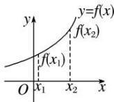
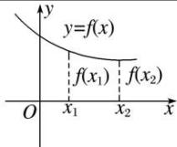
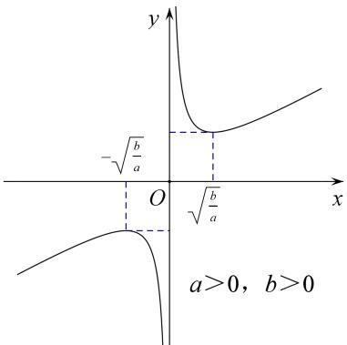
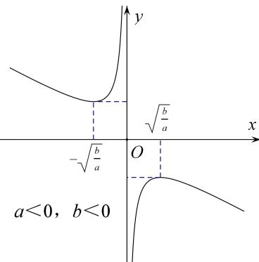
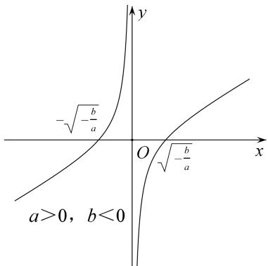
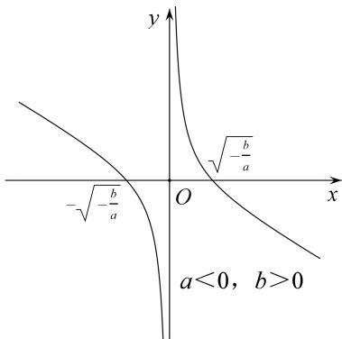

## 专题三 函数的单调性

## 1. 增函数、减函数的定义

<table><tr><td></td><td>增函数</td><td>减函数</td></tr><tr><td rowspan="2">定义</td><td colspan="2">一般地,设函数 $f(x)$ 的定义域为 $I$ ,如果对于定义域 $I$ 内某个区间 $D$ 上的任意两个自变量的值 $x_1$ , $x_2$ </td></tr><tr><td>当 $x_1 < x_2$ 时,都有 $f(x_1) < f(x_2)$ ,那么就说函数 $f(x)$ 在区间 $D$ 上是增函数</td><td>当 $x_1 < x_2$ 时,都有 $f(x_1) > f(x_2)$ ,那么就说函数 $f(x)$ 在区间 $D$ 上是减函数</td></tr><tr><td>图象描述</td><td>自左向右看图象是上升的</td><td>自左向右看图象是下降的</td></tr></table>

## 2. 单调性、单调区间的定义

若函数 $y = f(x)$ 在区间 $D$ 上是增函数或减函数，则称函数 $y = f(x)$ 在这一区间上具有(严格的)单调性，区间 $D$ 叫做函数 $y = f(x)$ 的单调区间.

单调区间是定义域的子集，故求单调区间时应树立“定义域优先”的原则．单调区间只能用区间表示，不能用集合或不等式表示；如有多个单调区间应分开写，不能用并集符号“∪”连接，也不能用“或”连接，只能用“，”或“和”隔开.

## 2. 常用结论

## 结论 1: 增函数与减函数形式的等价变形

$y = f(x)$ 在区间 $D$ 上是增函数 $\Leftrightarrow$ 对 $\forall x_{1} < x_{2}$ ，都有 $f(x_{1}) < f(x_{2}) \Leftrightarrow (x_{1} - x_{2}) [f(x_{1}) - f(x_{2})] > 0 \Leftrightarrow \frac{f(x_{1}) - f(x_{2})}{x_{1} - x_{2}} > 0$ ; $y = f(x)$ 在区间 $D$ 上是减函数 $\Leftrightarrow$ 对 $\forall x_{1} < x_{2}$ ，都有 $f(x_{1}) > f(x_{2}) \Leftrightarrow (x_{1} - x_{2}) [f(x_{1}) - f(x_{2})] < 0 \Leftrightarrow \frac{f(x_{1}) - f(x_{2})}{x_{1} - x_{2}} < 0$ .

结论 2: 单调性的运算性质

(1)函数 $y=f(x)$ 与函数 $y=f(x)+C$ (C 为常数) 具有相同的单调性.

(2)若 k>0，则 $kf(x)$ 与 $f(x)$ 单调性相同；若 k<0，则 $kf(x)$ 与 $f(x)$ 单调性相反.

(3)在公共定义域内，函数 $y=f(x)(f(x)>0)$ 与 $y=f^{n}(x)$ 和 $y=\sqrt[n]{f(x)}$ 具有相同的单调性.

(4)在公共定义域内，函数 $y = f(x)(f(x)\neq 0)$ 与 $y = \frac{1}{f(x)}$ 单调性相反.

(5)若 $f(x)$ ， $g(x)$ 均为区间 $A$ 上的增(减)函数，则 $f(x) + g(x)$ 也是区间 $A$ 上的增(减)函数.

(6)若 $f(x)$ ， $g(x)$ 均为区间 $A$ 上的增(减)函数，且 $f(x) > 0$ ， $g(x) > 0$ ，则 $f(x) \cdot g(x)$ 也是区间 $A$ 上的增(减)函数.

## 结论 3：复合函数的单调性

复合函数 $y = f[g(x)]$ 的单调性与 $y = f(u)$ 和 $u = g(x)$ 的单调性有关。若两个简单函数的单调性相同，则它们的复合函数为增函数；若两个简单函数的单调性相反，则它们的复合函数为减函数。简记：“同增异减”。

结论 4: 奇函数与偶函数的单调性

奇函数在其关于原点对称的区间上单调性相同，偶函数在其关于原点对称的区间上单调性相反.

结论 5: 对勾函数与飘带函数的单调性

对勾函数： $f(x)=ax+\frac{b}{x}(ab>0)$

(1)当 $a > 0$ ， $b > 0$ 时， $f(x)$ 在 $(-\infty , - \sqrt{\frac{b}{a}} ]$ ， $[\sqrt{\frac{b}{a}}, + \infty)$ 上是增函数，在 $[- \sqrt{\frac{b}{a}}, 0)$ ， $(0, \sqrt{\frac{b}{a}} ]$ 上是减函数；

(2)当 $a < 0$ ， $b < 0$ 时， $f(x)$ 在 $(-\infty , - \sqrt{\frac{b}{a}} ]$ ， $[\sqrt{\frac{b}{a}}, + \infty)$ 上是减函数，在 $[- \sqrt{\frac{b}{a}}, 0)$ ， $(0, \sqrt{\frac{b}{a}} ]$ 上是增函数；

飘带函数： $f(x)=ax+\frac{b}{x}(ab<0)$

(1)当 a>0, b<0 时， $f(x)$ 在 $(-∞, 0)$ ， $(0, +∞)$ 上都是增函数；

(2)当 a<0, b>0 时， $f(x)$ 在 $(-∞, 0)$ ， $(0, +∞)$ 上都是减函数；

![[高中/总复习/专题/函数/专题3    函数的单调性-函数/专题三_函数的单调性/考点一_确定函数的单调性或单调区间/考点一_确定函数的单调性或单调区间.md]]
![[高中/总复习/专题/函数/专题3    函数的单调性-函数/专题三_函数的单调性/考点二_比较函数值或自变量的大小/考点二_比较函数值或自变量的大小.md]]
![[高中/总复习/专题/函数/专题3    函数的单调性-函数/专题三_函数的单调性/考点三_解函数不等式/考点三_解函数不等式.md]]
![[高中/总复习/专题/函数/专题3    函数的单调性-函数/专题三_函数的单调性/考点四_求参数的取值范围/考点四_求参数的取值范围.md]]
