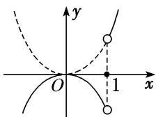

> [!faq]- 教师版对点训练解析
>
> > [!success]- **【答案】** B
>
> > [!note]- **【分析】**
> > 本题未单列分析。
>
> > [!note]- **【解析】**
> > 答案 B 解析 由题知， $g(x)=\left\{\begin{aligned}x^{2},&x>1,\\ 0,&x=1,\\ -x^{2},&x<1,\end{aligned}\right.$ 可得函数 $g(x)$ 的单调递减区间为 $[0,1)$ . 故选 B.
> > 
