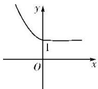

> [!faq]- 教师版对点训练解析
>
> > [!success]- **【答案】** D
>
> > [!note]- **【分析】**
> > 本题未单列分析。
>
> > [!note]- **【解析】**
> > 答案 D 解析 因为 $f(x)=\left\{\begin{aligned}&2^{-x},&x\leq0,\\ &1,&x>0,\end{aligned}\right.$ 所以函数 $f(x)$ 的图象如图所示. 由图可知, 当 $x+1\leq0$ 且 $2x\leq0$ 时, 函数 $f(x)$ 为减函数, 故 $f(x+1)<f(2x)$ 转化为 $x+1>2x$ , 此时 $x\leq-1$ ; 当 2x<0 且 $x+1>0$ 时, $f(2x)>1$ , $f(x+1)=1$ , 满足 $f(x+1)<f(2x)$ , 此时 -1<x<0. 综上, 不等式 $f(x+1)<f(2x)$ 的解集为 $(-∞,-1]\cup(-1,0)=(-∞,0)$ . 故选 D.
> > 
