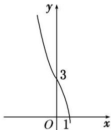

> [!faq]- 教师版对点训练解析
>
> > [!success]- **【答案】** 详见解析
>
> > [!note]- **【分析】**
> > 本题未单列分析。
>
> > [!note]- **【解析】**
> > 答案 $(- \infty, -2)$ 解析 作出函数 $f(x)$ 的图象的草图如图所示，易知函数 $f(x)$ 在 $\mathbb{R}$ 上为单调递减函数，所以不等式 $f(x + a) > f(2a - x)$ 在 $[a, a + 1]$ 上恒成立等价于 $x + a < 2a - x$ ，即 $x < \frac{a}{2}$ 在 $[a, a + 1]$ 上恒成立，所以只需 $a + 1 < \frac{a}{2}$ ，即 $a < -2$ .
> > 
