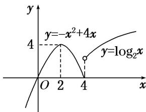

> [!faq]- 教师版对点训练解析
>
> > [!success]- **【答案】** D
>
> > [!note]- **【分析】**
> > 本题未单列分析。
>
> > [!note]- **【解析】**
> > 答案 D 解析 作出函数 $f(x)$ 的图象如图所示，由图象可知 $f(x)$ 在 $(a, a + 1)$ 上单调递增，需满足 $a \geq 4$ 或 $a + 1 \leq 2$ ，即 $a \leq 1$ 或 $a \geq 4$ ，故选 D.
> > 
