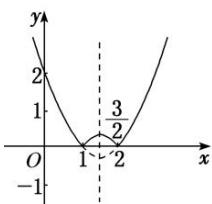

> [!faq]- 《专题3    函数的单调性-函数》例题解析
>
> > [!success]- **【答案】** B
>
> > [!note]- **【分析】**
> > 本题未单列分析。
>
> > [!note]- **【解析】**
> > 答案 B 解析 $y=|x^{2}-3x+2|=\left\{\begin{aligned}x^{2}-3x+2,&x\leq1\text{ 或 }x\geq2,\\ -(x^{2}-3x+2),&1<x<2.\end{aligned}\right.$ 如图所示，函数的单调递增区间是 $\left[1,\frac{3}{2}\right]$ 和 $[2,+\infty)$ .
> > 
