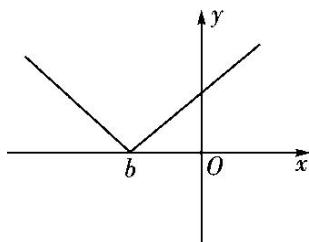

> [!faq]- 《专题3    函数的单调性-函数》例题解析
>
> > [!success]- **【答案】** B
>
> > [!note]- **【分析】**
> > 本题未单列分析。
>
> > [!note]- **【解析】**
> > 答案 $(- \infty, -2]$ 解析 二次函数的对称轴方程为 $x = -\frac{a - 1}{3}$ ，由题意知 $-\frac{a - 1}{3} \geq 1$ ，即 $a \leq -2$ .
> > (2) 已知函数 $f(x) = x - \frac{a}{x} + \frac{a}{2}$ 在 $(1, +\infty)$ 上是增函数，则实数 $a$ 的取值范围是 \_\_\_\_.
> > 答案 $[-1, +\infty)$ 解析 设 $1 < x_1 < x_2$ ， $\therefore x_1x_2 > 1$ 。\$\because\$ 函数 $f(x)$ 在 $(1, +\infty)$ 上是增函数，\$\therefore f(x\_1) - f(x\_2) = x\_1 - \frac{a}{x\_1} + \frac{a}{2} - \left( x\_2 - \frac{a}{x\_2} + \frac{a}{2} \right) = (x\_1 - x\_2) \left( 1 + \frac{a}{x\_1x\_2} \right) < 0\$。 $\because x_1 - x_2 < 0$ ，\$\therefore 1 + \frac{a}{x\_1x\_2} > 0\$，即 $a > -x_1x_2$ 。 $\because 1 < x_1 < x_2$ ， $x_1x_2 > 1$ ，\$\therefore -x\_1x\_2 < -1\$，\$\therefore a \geq -1\$。 $\therefore a$ 的取值范围是 $[-1, +\infty)$ .
> > (3)若函数 $f(x) = a|b - x| + 2$ 的单调递增区间是 $[0, +\infty)$ ，则实数 $a, b$ 的取值范围分别为 \_\_\_\_.
> > 答案 $(0, +\infty)$ ，0 解析 因为 $|b-x|=|x-b|$ ， $y=|x-b|$ 的图象如下：
> > 
> > 因为 $f(x)$ 的单调递增区间为 $[0, +\infty)$ ，所以 b=0，a>0。
> > (4) 已知函数 $f(x)=\left\{\begin{aligned} ax^{2}-x-\frac{1}{4}, & x \leq 1, \\ \log_{a}x-1, & x > 1\end{aligned}\right.$ 是 R 上的单调函数，则实数 a 的取值范围是( )
> > A. $\left[\frac{1}{4}, \frac{1}{2}\right]$ B. $\left[\frac{1}{4}, \frac{1}{2}\right]$ C. $\left[0, \frac{1}{2}\right]$ D. $\left[\frac{1}{2}, 1\right]$
> > 答案 B 解析 由对数函数的定义可得 a>0，且 $a\neq1$ 。又函数 $f(x)$ 在 R 上单调，而二次函数 $y=ax^{2}-x-\frac{1}{4}$ 的图象开口向上，所以函数 $f(x)$ 在 R 上单调递减，故有 $\left\{\begin{aligned}&0<a<1,\\ &\frac{1}{2a}\geq1,\\ &a\times1^{2}-1-\frac{1}{4}\geq\log_{a}1-1,\end{aligned}\right.$ 即 $\left\{\begin{aligned}&0<a<1,\\ &0<a\leq\frac{1}{2},\\ &a\geq\frac{1}{4}.\end{aligned}\right.$ 所以 $a\in\left[\frac{1}{4},\frac{1}{2}\right]$ .
> > (5) 已知函数 $f(x) = \log_{\frac{1}{2}} (x^2 - ax + 3a)$ 在 $[1, +\infty)$ 上单调递减，则实数 $a$ 的取值范围是 \_\_\_\_.
> > 答案 $\left[-\frac{1}{2}, 2\right]$ 解析 令 $t = g(x) = x^2 - ax + 3a$ ，易知 $f(t) = \log_{\frac{1}{2}} t$ 在其定义域上单调递减，要使 $f(x) = \log_{\frac{1}{2}} (x^2 - ax + 3a)$ 在 $[1, +\infty)$ 上单调递减，则 $t = g(x) = x^2 - ax + 3a$ 在 $[1, +\infty)$ 上单调递增，且 $t = g(x) = x^2 - ax + 3a > 0$ ，即 $\left\{ \begin{array}{ll} -\frac{-a}{2} \leq 1, & \\ g & 1 > 0, \end{array} \right.$ 所以 $\left\{ \begin{array}{ll} a \leq 2, & \\ a > -\frac{1}{2}, & \text{即} -\frac{1}{2} < a \leq 2. \end{array} \right.$
> > ## 【对点训练】
