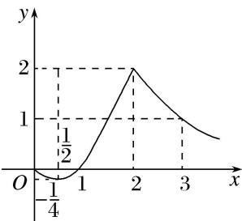

<!-- question-source:start -->
[例 2] (1) 函数 $y=|x+1|+|x-2|$ 的值域为 \_\_\_\_.

(2) 已知函数 $f(x) = \begin{cases} x^2 - x, & 0 \leq x \leq 2, \\ \frac{2}{x - 1}, & x > 2, \end{cases}$ 函数 $f(x)$ 的最大值为 \_\_\_\_。最小值为 \_\_\_\_. 答案 2 $-\frac{1}{4}$ 解析 作出 $f(x)$ 的图象如图.

由图象可知，当 $x = 2$ 时， $f(x)$ 取最大值为 2；当 $x = \frac{1}{2}$ 时， $f(x)$ 取最小值为 $-\frac{1}{4}$ 。所以 $f(x)$ 的最大值为 2，最小值为 $-\frac{1}{4}$ 。

(3) 对 $a, b \in \mathbf{R}$ , 记 $\max\{a, b\} = \begin{cases} a, & a \geq b, \\ b, & a < b, \end{cases}$ 函数 $f(x) = \max\{|x + 1|, |x - 2|\}(x \in \mathbf{R})$ 的最小值是 \_\_\_\_.

(4) 定义 $\min \{a, b, c\}$ 为 $a, b, c$ 中的最小值，设 $f(x) = \min \{2x + 3, x^2 + 1, 5 - 3x\}$ ，则 $f(x)$ 的最大值是 \_\_\_\_.

(5) 设函数 $y = f(x)$ 定义域为 $\mathbf{R}$ ，对给定正数 $M$ ，定义函数 $f_{M}(x) = \begin{cases} f(x), & f(x) \leq M \\ M, & f(x) > M \end{cases}$ 则称函数 $f_{M}(x)$ 为 $f(x)$ 的“孪生函数”，若给定函数 $f(x) = \begin{cases} 2 - x^2, & -2 \leq x \leq 0 \\ 2^x - 1, & x > 0 \end{cases}$ ， $M = 1$ ，则 $y = f_{M}(x)$ 的值域为（）A. $[-2, 1]$ B. $[-1, 2]$ C. $(-∞, 2]$ D. $(-∞, -1]$
<!-- question-source:end -->

![[高中/总复习/专题/函数/专题4    函数的最值(值域)-函数/专题四_函数的最值_值域_/考点二_图象法/例题选讲/例题/answers/Q00029903A1.md]]
