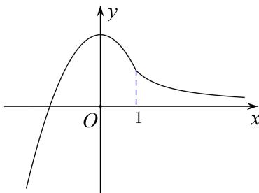

> [!faq]- 教师版对点训练解析
>
> > [!success]- **【答案】** 详见解析
>
> > [!note]- **【分析】**
> > 本题未单列分析。
>
> > [!note]- **【解析】**
> > 答案 2 解析 当 $x \geq 1$ 时，函数 $f(x) = \frac{1}{x}$ 为减函数，所以 $f(x)$ 在 $x = 1$ 处取得最大值，为 $f(1) = 1$ ；当 $x < 1$ 时，易知函数 $f(x) = -x^2 + 2$ 在 $x = 0$ 处取得最大值，为 $f(0) = 2$ 。故函数 $f(x)$ 的最大值为 2。
> > 
