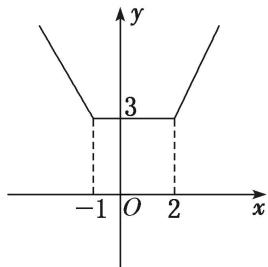

> [!faq]- 《专题4    函数的最值(值域)-函数》例题解析
>
> > [!success]- **【答案】** 详见解析
>
> > [!note]- **【分析】**
> > 本题未单列分析。
>
> > [!note]- **【解析】**
> > 答案 $[3, +\infty)$ 解析 函数 $y = \begin{cases} -2x + 1, & x \leq -1, \\ 3, & -1 < x < 2, \\ 2x - 1, & x \geq 2. \end{cases}$ 作出函数的图象如图所示。根据图象可知，函数 $y = |x + 1| + |x - 2|$ 的值域为 $[3, +\infty)$ 。
> > 
