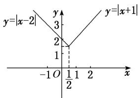

> [!faq]- 《专题4    函数的最值(值域)-函数》例题解析
>
> > [!success]- **【答案】** 详见解析
>
> > [!note]- **【解析】**
> > 答案 $\frac{3}{2}$ 解析 由 $|x + 1|\geq |x - 2|$ ，得 $(x + 1)^{2}\geq (x - 2)^{2}$ 所以 $x\geq \frac{1}{2}$ 所以 $f(x) = \left\{ \begin{array}{ll} |x + 1|, & x\geq \frac{1}{2},\\ |x - 2|, & x <   \frac{1}{2}. \end{array} \right.$ 其图象如图所示.
> >
> > 
> >
> > 由图象易知，当 $x=\frac{1}{2}$ 时，函数有最小值，所以 $f(x)_{\min}=f\left(\frac{1}{2}\right)=\left|\frac{1}{2}+1\right|=\frac{3}{2}$ .
