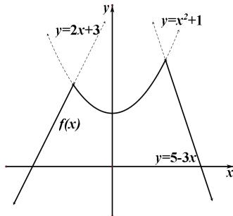

> [!faq]- 《专题4    函数的最值(值域)-函数》例题解析
>
> > [!success]- **【答案】** 详见解析
>
> > [!note]- **【分析】**
> > 本题未单列分析。
>
> > [!note]- **【解析】**
> > 答案 2 解析 本题若利用 $\min \{a, b, c\}$ 的定义将 $f(x)$ 转为分段函数，则需要对三个式子两两比较，比较繁琐，故考虑进行数形结合，将三个解析式的图像作在同一坐标系下，则 $f(x)$ 为三段函数图像中靠下的部分，从而通过数形结合可得 $f(x)$ 的最大值点为 $y = x^2 + 1$ 与 $y = 5 - 3x$ 在第一象限的交点，即
> >
> > $\left\{\begin{aligned}y&=x^{2}+1\\ y&=5-3x\end{aligned}\right.\Rightarrow\left\{\begin{aligned}x&=1\\ y&=2\end{aligned}\right.$ ，所以 $f(x)_{\max}=2$ 。
> >
> > 
