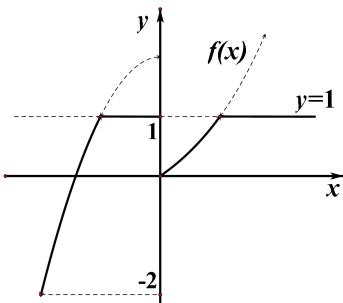

> [!faq]- 《专题4    函数的最值(值域)-函数》例题解析
>
> > [!success]- **【答案】** A
>
> > [!note]- **【分析】**
> > 本题未单列分析。
>
> > [!note]- **【解析】**
> > 答案 A 解析 根据“孪生函数”定义不难发现其图像特点，即以 y=M 为分界线， $f(x)$ 图像在 y=M 下方的图像不变，在 M 上方的图像则变为 y=M ，通过作图即可得到 $f_{M}(x)$ 的值域为 $[-2,1]$ .
> > 
> > ## 【对点训练】
