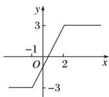

> [!faq]- 《专题4    函数的最值(值域)-函数》例题解析
>
> > [!success]- **【答案】** 详见解析
>
> > [!note]- **【解析】**
> > 答案 3 -3 解析 $y = |x + 1| - |x - 2| = \begin{cases} -3, & x \leq -1, \\ 2x - 1, & -1 < x < 2, \\ 3, & x \geq 2. \end{cases}$ 作出函数的图象，由图可知， $y \in [-3,$
> >
> > 3]. 所以函数的最大值为 3，最小值为 -3.
> >
> > 
