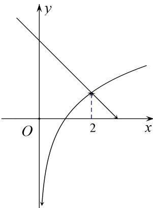

> [!faq]- 《专题4    函数的最值(值域)-函数》例题解析
>
> > [!success]- **【答案】** 详见解析
>
> > [!note]- **【分析】**
> > 本题未单列分析。
>
> > [!note]- **【解析】**
> > 答案 1 解析 依题意， $h(x)=\left\{\begin{aligned}\log_{2}x, & 0<x\leq2,\\ -x+3, & x>2.\end{aligned}\right.$ 当 $0<x\leq2$ 时， $h(x)=\log_{2}x$ 是增函数，当 x>2 时， $h(x)=3-x$ 是减函数，则 $h(x)_{\max}=h(2)=1$ .
> > 
