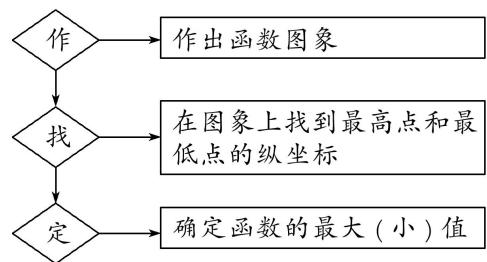

## 考点二 图象法

## 【方法总结】

即作出函数的图像，通过观察曲线所覆盖函数值的区域确定值域，以下函数常会考虑进行数形结合.

(1)分段函数：尽管分段函数可以通过求出每段解析式的范围再取并集的方式解得值域，但对于一些便于作图的分段函数，数形结合也可很方便的计算值域.

(2) $f(x)$ 的函数值为多个函数中函数值的最大值或最小值，此时需将多个函数作于同一坐标系中，然后确定靠下(或靠上)的部分为该 $f(x)$ 函数的图像，从而利用图像求得函数的值域.

图象法求函数最值的一般步骤  

## 【例题选讲】

[例 2]
![[高中/总复习/专题/函数/专题4    函数的最值(值域)-函数/考点02_图象法/例题/Q00044635.md]]
![[高中/总复习/专题/函数/专题4    函数的最值(值域)-函数/考点02_图象法/例题/Q00044636.md]]
![[高中/总复习/专题/函数/专题4    函数的最值(值域)-函数/考点02_图象法/例题/Q00044637.md]]
![[高中/总复习/专题/函数/专题4    函数的最值(值域)-函数/考点02_图象法/例题/Q00044638.md]]
![[高中/总复习/专题/函数/专题4    函数的最值(值域)-函数/考点02_图象法/对点训练/Q00041344.md]]
![[高中/总复习/专题/函数/专题4    函数的最值(值域)-函数/考点02_图象法/对点训练/Q00044639.md]]
![[高中/总复习/专题/函数/专题4    函数的最值(值域)-函数/考点02_图象法/对点训练/Q00044640.md]]
![[高中/总复习/专题/函数/专题4    函数的最值(值域)-函数/考点02_图象法/对点训练/Q00041347.md]]
