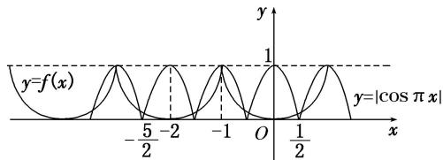

> [!faq]- 教师版对点训练解析
>
> > [!success]- **【答案】** A
>
> > [!note]- **【分析】**
> > 本题未单列分析。
>
> > [!note]- **【解析】**
> > 答案 A 解析：因为函数 $f(x)$ 为偶函数，所以 $f(-x - 1) = f(x + 1) = f(x - 1)$ ，即 $f(x) = f(x + 2)$ ，所以函数 $f(x)$ 的周期为2，又当 $x \in [-1,0]$ 时， $f(x) = -x^3$ ，由此在同一平面直角坐标系内作出函数 $y = f(x)$ 与 $y = |\cos \pi x|$ 的图象，如图所示.
> > 
> > 由图知关于 $x$ 的方程 $f(x) = |\cos \pi x|$ 在 $\left[-\frac{5}{2}, \frac{1}{2}\right]$ 上的实数解有7个. 不妨设 $x_{1} < x_{2} < x_{3} < x_{4} < x_{5} < x_{6} < x_{7}$ , 则由图, 得 $x_{1} + x_{2} = -4$ , $x_{3} + x_{5} = -2$ , $x_{4} = -1$ , $x_{6} + x_{7} = 0$ , 所以方程 $f(x) = |\cos \pi x|$ 在 $\left[-\frac{5}{2}, \frac{1}{2}\right]$ 上的所有实数解的和为 $-4 - 2 - 1 + 0 = -7$ ,
> >
> > 故选 **A**.
