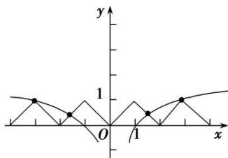
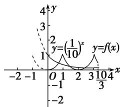
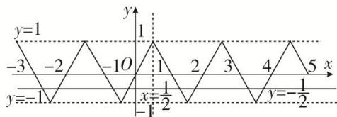

> [!faq]- 《专题7　函数奇偶性与周期性的综合问题-函数》例题解析
>
> > [!success]- **【答案】** C
>
> > [!note]- **【分析】**
> > 本题未单列分析。
>
> > [!note]- **【解析】**
> > 答案 C 解析 由 $f(x + 2) = f(x)$ 可得函数的周期为 2，又函数为偶函数且当 $x \in [0,1]$ 时， $f(x) = x$ ，故可作出函数 $f(x)$ 的图象，
> > 
> > ∴方程 $f(x)=\log_{3}|x|$ 的解个数等价于 $f(x)$ 与 $y=\log_{3}|x|$ 图象的交点，由图象可得它们有 4 个交点，故方程 $f(x)=\log_{3}|x|$ 的解个数为 4，故选 C.
> > (2)若偶函数 $f(x)$ 满足 $f(x - 1) = f(x + 1)$ ，且在 $x \in [0,1]$ 时， $f(x) = x^2$ ，则关于 $x$ 的方程 $f(x) = \left(\frac{1}{10}\right)x$ 在 $\left[0, \frac{10}{3}\right]$ 上的根的个数是（）A. 1 B. 2 C. 3 D. 4
> > 答案 C 解析：因为 $f(x)$ 为偶函数，所以当 $x \in [-1, 0]$ 时， $-x \in [0, 1]$ ，所以 $f(-x) = x^{2}$ ，即 $f(x) = x^{2}$ ，又 $f(x - 1) = f(x + 1)$ ，所以 $f(x + 2) = f(x)$ ，故 $f(x)$ 是以 2 为周期的周期函数，据此在同一坐标系中作出函数 $y = f(x)$ 与 $y = \left(\frac{1}{10}\right)^{x}$ 在 $\left[0, \frac{10}{3}\right]$ 上的图象如图所示，数形结合得两图象有 3 个交点，故方程 $f(x) = \left(\frac{1}{10}\right)^{x}$ 在 $\left[0, \frac{10}{3}\right]$ 上有三个根．故选 C.
> > 
> > (3)已知函数 $f(x)$ 对任意的 $x \in \mathbf{R}$ ，都有 $f(\frac{1}{2} + x) = f(\frac{1}{2} - x)$ ，函数 $f(x + 1)$ 是奇函数，当 $-\frac{1}{2} \leq x \leq \frac{1}{2}$ 时， $f(x) = 2x$ ，则方程 $f(x) = -\frac{1}{2}$ 在区间 $[-3, 5]$ 内的所有根的和为 \_\_\_\_.
> > 答案 4 解析 ∵函数 $f(x+1)$ 是奇函数，∴函数 $f(x+1)$ 的图象关于点 $(0,0)$ 对称，把函数 $f(x+1)$ 的图象向右平移 1 个单位可得函数 $f(x)$ 的图象，即函数 $f(x)$ 的图象关于点 $(1,0)$ 对称，则 $f(2-x)=-f(x)$ . 又 ∵ $f(\frac{1}{2}+x)=f(\frac{1}{2}-x)$ , ∴ $f(1-x)=f(x)$ ，从而 $f(2-x)=-f(1-x)$ , ∴ $f(x+1)=-f(x)$ ，即 $f(x+2)=-f(x+1)=f(x)$ , ∴ 函数 $f(x)$ 的周期为 2，且图象关于直线 $x=\frac{1}{2}$ 对称．画出函数 $f(x)$ 的图象如图所示.
> > 
> > ∴结合图象可得方程 $f(x)=-\frac{1}{2}$ 在区间 $[-3,5]$ 内有 8 个根，且所有根之和为 $\frac{1}{2}\times2\times4=4$ .
> > 【对点训练】
