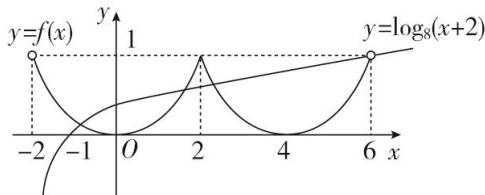

> [!faq]- 《专题7　函数奇偶性与周期性的综合问题-函数》例题解析
>
> > [!success]- **【答案】** C
>
> > [!note]- **【分析】**
> > 本题未单列分析。
>
> > [!note]- **【解析】**
> > 答案 C 解析 原方程等价于 $y = f(x)$ 与 $y = \log_8 (x + 2)$ 的图象的交点个数问题，由 $f(x + 2) = f(2 - x)$ ，可知 $f(x)$ 的图象关于 $x = 2$ 对称，再根据 $f(x)$ 是偶函数这一性质，可由 $f(x)$ 在 $[-2, 0]$ 上的解析式，作出 $f(x)$ 在 $(0, 2)$ 上的图象，进而作出 $f(x)$ 在 $(-2, 6)$ 上的图象，如图所示.
> >
> > 
> >
> > 再在同一坐标系下，画出 $y=\log_{8}(x+2)$ 的图象，注意其图象过点(6,1)，由图可知，两图象在区间(-2,6)内有三个交点，从而原方程有三个根，
> >
> > 故选 **C**.
