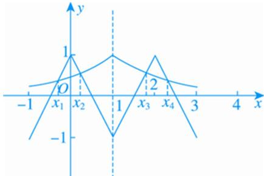

> [!faq]- 《专题7　函数奇偶性与周期性的综合问题-函数》例题解析
>
> > [!success]- **【答案】** B
>
> > [!note]- **【解析】**
> > 答案 B 解析 $\because f(x + 1) = -f(x), \therefore f(x + 2) = -f(x + 1) = f(x), \therefore f(x)$ 的周期为 2．又 $f(x)$ 为偶函数， $\therefore f(1 - x) = f(x - 1) = f(x + 1)$ ，故 $f(x)$ 的图象关于直线 $x = 1$ 对称．又 $g(x) = \left(\frac{1}{2}\right)^{|x - 1|} (-1 \leq x \leq 3)$ 的图象关于直线 $x = 1$ 对称，作出 $f(x)$ 和 $g(x)$ 的图象如图所示.
> >
> > 
> >
> > 由图象可知两函数图象在[-1, 3]上共有4个交点，分别记从左到右各交点的横坐标为 $x_{1}$ ， $x_{2}$ ， $x_{3}$ ， $x_{4}$ ，可知 $x=x_{1}$ 与 $x=x_{4}$ ， $x=x_{2}$ 与 $x=x_{3}$ 分别关于x=1对称，∴所有交点的横坐标之和为 $x_{1}+x_{2}+x_{3}+x_{4}=1\times2\times2=4$ ，
> >
> > 故选 **B**.
