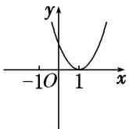
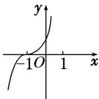
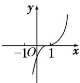
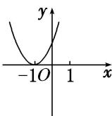

<!-- question-source:start -->
3. 已知函数 $f(x - 1)$ 是定义在 $\mathbf{R}$ 上的奇函数，且在 $[0, +\infty)$ 上是增函数，则函数 $f(x)$ 的图象可能是（）

A

B

C

D
<!-- question-source:end -->

![[高中/总复习/专题/函数/专题8　函数奇偶性与单调性的综合问题-函数/专题八_函数奇偶性与单调性的综合问题/考点一_奇偶性与单调性的判断/对点训练/题目/answers/Q00029992A1.md]]
