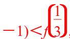

<!-- question-source:start -->
17. 已知偶函数 $f(x)$ 在区间 $[0, +\infty)$ 上单调递增，则满足 $f(2x - 1) < f\left(\frac{1}{3}\right)$ 的 $x$ 的取值范围是（）A. $\left[\frac{1}{3}, \frac{2}{3}\right]$ B. $\left[\frac{1}{3}, \frac{2}{3}\right]$ C. $\left[\frac{1}{2}, \frac{2}{3}\right]$ D. $\left[\frac{1}{2}, \frac{2}{3}\right]$

<!-- question-source:end -->

![[高中/总复习/专题/函数/专题8　函数奇偶性与单调性的综合问题-函数/专题八_函数奇偶性与单调性的综合问题/考点三_解不等式_抽象函数_/对点训练/题目/answers/Q00030008A1.md]]
