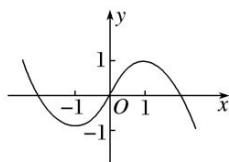

<!-- question-source:start -->
[例 4](1)已知函数 $f(x)=\sin x+x$ ，对任意的 $m\in[-2,2]$ ， $f(mx-2)+f(x)<0$ 恒成立，则 x 的取值范围是 \_\_\_\_.

(2)若 $f(x)=\mathrm{e}^{x}-a\mathrm{e}^{-x}$ 为奇函数，则满足 $f(x-1)\geqslant\frac{1}{\mathrm{e}^{2}}-\mathrm{e}^{2}$ 的x的取值范围是( )

A. $(-2,+\infty)$ B. $(-1,+\infty)$ C. $(2,+\infty)$ D. $(3,+\infty)$

(3)设函数 $f(x)=\ln(1+|x|)-\frac{1}{1+x^{2}}$ ，则使得 $f(x)>f(2x-1)$ 成立的 x 的取值范围为 \_\_\_\_.

(4)已知 $g(x)$ 是定义在 R 上的奇函数，且当 x<0 时， $g(x)=-\ln(1-x)$ ，函数 $f(x)=\left\{\begin{aligned}x^{3},&x\leq0,\\ g(x),&x>0,\end{aligned}\right.$ 若 $f(2-x^{2})>f(x)$ ，则 x 的取值范围是（）A. $(-∞,-2)∪(1,+∞)$ B. $(-∞,1)∪(2,+∞)$ C. $(-2,1)$ D. $(1,2)$

(5)已知函数 $f(x) = \begin{cases} -x^2 + 2x, & x > 0, \\ 0, & x = 0, \\ x^2 + mx, & x < 0 \end{cases}$ 是奇函数．若函数 $f(x)$ 在区间 $[-1, a - 2]$ 上单调递增，则实数

答案 解(1, 3]析 设 $x < 0$ ，则 $-x > 0$ ，所以 $f(-x) = -(-x)^2 + 2(-x) = -x^2 - 2x$ 。又 $f(x)$ 为奇函数，所以 $f(-x) = -f(x)$ ，于是 $x < 0$ 时， $f(x) = x^2 + 2x = x^2 + mx$ ，所以 $m = 2$ 。要使 $f(x)$ 在 $[-1, a - 2]$ 上单调递增，结合 $f(x)$ 的图象(如图所示)知 $\left\{ \begin{array}{l} a - 2 > -1, \\ a - 2 \leq 1, \end{array} \right.$ 所以 $1 < a \leq 3$ ，故实数 $a$ 的取值范围是(1, 3].

<!-- question-source:end -->

![[高中/总复习/专题/函数/专题8　函数奇偶性与单调性的综合问题-函数/专题八_函数奇偶性与单调性的综合问题/考点四_解不等式_具体函数_/例题选讲/例题/answers/Q00030014A1.md]]
