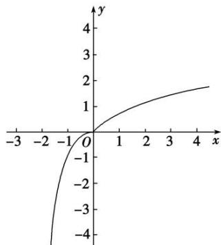

> [!faq]- 教师版例题解析
>
> > [!success]- **【答案】** (1) $-2 < x < \frac{2}{3}$；(2) B；(3) $\left(\frac{1}{3}, 1\right)$；(4) C
>
> > [!note]- **【分析】**
> > 本题未单列分析。
>
> > [!note]- **【解析】**
> > 答案 $-2 < x < \frac{2}{3}$ 解析 易知 $f(x)$ 在 $\mathbf{R}$ 上为单调递增函数，且 $f(x)$ 为奇函数，故 $f(mx - 2) + f(x) < 0$ 等价于 $f(mx - 2) < -f(x) = f(-x)$ ，则 $mx - 2 < -x$ ，即 $mx + x - 2 < 0$ 对所有 $m \in [-2, 2]$ 恒成立，令 $h(m) = mx + x - 2$ ， $m \in [-2, 2]$ ，此时，只需 $\left\{ \begin{array}{l} h(-2) < 0, \\ h(2) < 0 \end{array} \right.$ 即可，解得 $-2 < x < \frac{2}{3}$ .
> > 答案 B 解析 由 $f(x)=\mathrm{e}^{x}-a\mathrm{e}^{-x}$ 为奇函数，得 $f(-x)=-f(x)$ ，即 $e^{-x}-a\mathrm{e}^{x}=a\mathrm{e}^{-x}-\mathrm{e}^{x}$ ，得 a=1，所以$f(x)=\mathrm{e}^{x}-\mathrm{e}^{-x}$ ，则 $f(x)$ 在R上单调递增，又 $f(x-1)>\frac{1}{\mathrm{e}^{2}}-\mathrm{e}^{2}=f(-2)$ ，所以x-1>-2，解得x>-1，故选B.
> > 答案 $\left(\frac{1}{3}, 1\right)$ 解析 由已知得函数 $f(x)$ 为偶函数，所以 $f(x) = f(|x|)$ ，由 $f(x) > f(2x - 1)$ ，可得 $f(|x|) > f(|2x - 1|)$ 。当 $x > 0$ 时， $f(x) = \ln (1 + x) - \frac{1}{1 + x^2}$ ，因为 $y = \ln (1 + x)$ 与 $y = -\frac{1}{1 + x^2}$ 在 $(0, +\infty)$ 上都单调递增，所以函数 $f(x)$ 在 $(0, +\infty)$ 上单调递增。由 $f(|x|) > f(|2x - 1|)$ ，可得 $|x| > |2x - 1|$ ，两边平方可得 $x^2 > (2x - 1)^2$ ，整理得 $3x^2 - 4x + 1 < 0$ ，解得 $\frac{1}{3} < x < 1$ 。所以符合题意的 $x$ 的取值范围为 $\left(\frac{1}{3}, 1\right)$ 。
> > 答案 C 解析 因为 $g(x)$ 是定义在 R 上的奇函数，且当 x<0 时， $g(x)=-\ln(1-x)$ ，所以当 x>0 时，-x<0， $g(-x)=-\ln(1+x)$ ，即当 x>0 时， $g(x)=\ln(1+x)$ ，因为函数 $f(x)=\left\{\begin{aligned}x^{3},&x\leq0,\\ g(x),&x>0,\end{aligned}\right.$ 所以函数 $f(x)=\left\{\begin{aligned}x^{3},&x\leq0\\ \ln(1+x),&x>0\end{aligned}\right.$ . 函数 $f(x)$ 的图象如下：
> > 
> > 可判断 $f(x) = \begin{cases} x^3, & x \leq 0, \\ \ln(1 + x), & x > 0 \end{cases}$ . 在 $(- \infty, + \infty)$ 上单调递增．因为 $f(2 - x^2) > f(x)$ ，所以 $2 - x^2 > x$ ，解得 $-2 < x < 1$ ．
> >
> > 故选 **C**.
