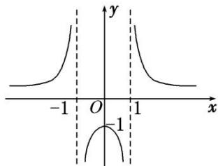
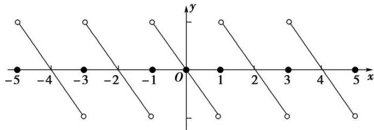

> [!faq]- 教师版例题解析
>
> > [!success]- **【答案】** (1) ③④；(2) ①②；(3) ①②③；(4) ①②③；(5) ①②③④
>
> > [!note]- **【分析】**
> > 本题未单列分析。
>
> > [!note]- **【解析】**
> > 函数 $f(x) = \frac{1}{|x| - 1} = \begin{cases} \frac{1}{x - 1}, & x \geq 0, \\ \frac{1}{-x - 1}, & x < 0, \end{cases}$ 其图象如图所示，由图象可知 $f(x)$ 的值域为 $(- \infty, -1) \cup (0, +\infty)$ ，故①错； $f(x)$ 在 $(0,1)$ 和 $(1, +\infty)$ 上单调递减，而在 $(0, +\infty)$ 上不是单调的，故②错； $f(x)$ 的图象关于 $y$ 轴对称，故③正确；由于 $f(x)$ 在每个象限都有图象，所以与过原点的直线 $y = ax (a \neq 0)$ 至少有一个交点，故④正确.
> > 
> > 答案 ①② 解析 由 $f(x + 1) = f(x - 1)$ 得 $f(x + 2) = f(x)$ ，因此2是函数 $f(x)$ 的周期，故①正确；由题意知，在区间[0,1]上，函数 $f(x)$ 是增函数。在区间[-1,0]上，函数 $f(x)$ 是减函数，由函数的周期性知，函数 $f(x)$ 在(1,2)上是减函数，在(2,3)上是增函数，故②正确；函数 $f(x)$ 的最大值为2，最小值为1，故③错误。
> > 答案 ①②③ 解析 $f(x + 3) = f\left[\left(x + \frac{3}{2}\right) + \frac{3}{2}\right] = -f\left(x + \frac{3}{2}\right) = f(x)$ ，所以 $f(x)$ 是周期为3的周期函数，①正确；函数 $f\left[x - \frac{3}{4}\right]$ 是奇函数，其图象关于点(0,0)对称，则 $f(x)$ 的图象关于点 $\left[-\frac{3}{4}, 0\right]$ 对称，②正确；因为 $f(x)$ 的图象关于点 $\left[-\frac{3}{4}, 0\right]$ 对称， $-\frac{3}{4} = \frac{-x + \left(-\frac{3}{2} + x\right)}{2}$ ，所以 $f(-x) = -f\left(-\frac{3}{2} + x\right)$ ，又 $f\left[-\frac{3}{2} + x\right] = -f\left(-\frac{3}{2} + x + \frac{3}{2}\right) = -f(x)$ ，所以 $f(-x) = f(x)$ ，③正确； $f(x)$ 是周期函数在R上不可能是单调函数，④错误。故真命题的序号为①②③。
> > 答案 ①②③ 解析：令 $f(x - 1) = f(x + 1)$ 中 $x = 0$ ，得 $f(-1) = f(1)$ . $\because f(-1) = -f(1), \therefore 2f(1) = 0, \therefore f(1) = 0$ ，故①正确；由 $f(x - 1) = f(x + 1)$ 得 $f(x) = f(x + 2), \therefore f(x)$ 是周期为2的周期函数， $\therefore f(2) = f(0) = 0$ ，又当 $x \in (0, 1)$ 且 $x_{1} \neq x_{2}$ 时，有 $\frac{f(x_2) - f(x_1)}{x_2 - x_1} < 0$ ， $\therefore$ 函数在区间(0,1)上单调递减，可作函数的简图如图：由图知②③正确，④不正确， $\therefore$ 正确命题的序号为①②③
> > 
> > 答案 ①②③④ 解析 $f(x + y) = f(x) + f(y)$ 对任意 $x, y \in \mathbb{R}$ 恒成立。令 $x = y = 0$ ，所以 $f(0) = 0$ 。令 $x + y = 0$ ，所以 $y = -x$ ，所以 $f(0) = f(x) + f(-x)$ 。所以 $f(-x) = -f(x)$ ，所以 $f(x)$ 为奇函数。因为 $f(x)$ 在 $x \in [-1, 0]$ 上为增函数，又 $f(x)$ 为奇函数，所以 $f(x)$ 在[0, 1]上为增函数。由 $f(x + 2) = -f(x) \Rightarrow f(x + 4) = -f(x + 2) = f(x)$ ，所以周期 $T = 4$ ，即 $f(x)$ 为周期函数。 $f(x + 2) = -f(x) \Rightarrow f(-x + 2) = -f(-x)$ 。又因为 $f(x)$ 为奇函数，所以 $f(2 - x) = f(x)$ ，所以函数关于 $x = 1$ 对称。由 $f(x)$ 在[0, 1]上为增函数，又关于 $x = 1$ 对称，所以 $f(x)$ 在[1, 2]上为减函数。由 $f(x + 2) = -f(x)$ ，令 $x = 0$ 得 $f(2) = -f(0) = f(0)$ 。
