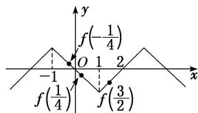

> [!faq]- 《专题9 函数的奇偶性、周期性与单调性的综合问题-函数》例题解析
>
> > [!success]- **【答案】** A
>
> > [!note]- **【分析】**
> > 本题未单列分析。
>
> > [!note]- **【解析】**
> > 答案 C 解析 由题设知： $f(x) = -f(x - 2) = f(2 - x)$ ，所以函数 $f(x)$ 的图象关于直线 $x = 1$ 对称；函数 $f(x)$ 是奇函数，其图象关于坐标原点对称，由于函数 $f(x)$ 在[0, 1]上是减函数，所以 $f(x)$ 在[-1, 0]上也是减函数，综上函数 $f(x)$ 在[-1, 1]上是减函数；又 $f(\frac{3}{2}) = f(2 - \frac{3}{2}) = f(\frac{1}{2})$ ， $-\frac{1}{4} < \frac{1}{4} < \frac{1}{2}$ ，∴ $f(\frac{1}{2}) < f(\frac{1}{4}) < f(-\frac{1}{4})$ ，即 $f(\frac{3}{2}) < f(\frac{1}{4}) < f(-\frac{1}{4})$ .
> >
> > 
