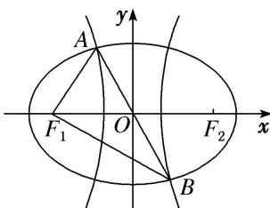

<!-- question-source:start -->
(12)如图， $F_{1}$ ， $F_{2}$ 是椭圆 $C_{1}$ 与双曲线 $C_{2}$ 的公共焦点，A，B 分别是 $C_{1}$ ， $C_{2}$ 在第二、四象限的交点，若 $AF_{1} \perp BF_{1}$ ，且 $\angle AF_{1}O = \frac{\pi}{3}$ ，则 $C_{1}$ 与 $C_{2}$ 的离心率之和为（）

A. $2\sqrt{3}$ B. 4 C. $2\sqrt{5}$ D. $2\sqrt{6}$
<!-- question-source:end -->

![[高中/总复习/专题/圆锥曲线/专题01 5组秒杀公式模型-圆锥曲线/专题01_5组秒杀公式模型/例题/answers/Q00042296A1.md]]
