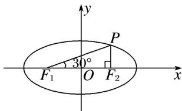

> [!faq]- 《专题01 5组秒杀公式模型-圆锥曲线》例题解析
>
> > [!success]- **【答案】** B
>
> > [!note]- **【解析】**
> > 答案 D 解析 秒杀 在 Rt△PF₂F₁ 中，令 |PF₂| = 1，∵∠PF₁F₂ = 30°，∴ |PF₁| = 2，|F₁F₂| = √3。∴ e = $\frac{2c}{2a} = \frac{|F_1F_2|}{|PF_1| + |PF_2|} = \frac{\sqrt{3}}{3}$ 。
> >
> > 通法 如图，在 Rt△PF₂F₁ 中，∠PF₁F₂=30°，|F₁F₂|=2c，∴|PF₁|= $\frac{2c}{\cos 30^\circ}$ = $\frac{4\sqrt{3}c}{3}$ ，
> >
> > 
> >
> > $|PF_{2}|=2c\cdot\tan30^{\circ}=\frac{2\sqrt{3}c}{3}.$ $\because|PF_{1}|+|PF_{2}|=2a,$ 即 $\frac{4\sqrt{3}c}{3}+\frac{2\sqrt{3}c}{3}=2a,$ 可得 $\sqrt{3}c=a.$ $\therefore e=\frac{c}{a}=\frac{\sqrt{3}}{3}.$
