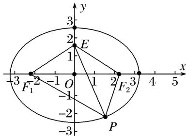

> [!faq]- 《专题01 5组秒杀公式模型-圆锥曲线》例题解析
>
> > [!success]- **【答案】** 详见解析
>
> > [!note]- **【分析】**
> > 本题未单列分析。
>
> > [!note]- **【解析】**
> > 答案 $\sqrt{2}$ 解析 秒杀 因为 $\overrightarrow{MF} \cdot \overrightarrow{NF} = 0$ ，所以 $\overrightarrow{MF} \perp \overrightarrow{NF}$ 。设双曲线的左焦点为 $F'$ ，则由双曲线的对称性知四边形 $F'MFN$ 为矩形，则有 $|MF| = |NF'|$ ， $|MN| = 2c$ 。不妨设点 $N$ 在双曲线右支上，由双曲线的定义知， $|NF'| - |NF| = 2a$ ，所以 $|MF| - |NF| = 2a$ 。因为 $S_{\triangle MNF} = \frac{1}{2} |MF| \cdot |NF| = ab$ ，所以 $|MF||NF| = 2ab$ 。在 Rt△MNF 中， $|MF|^2 + |NF|^2 = |MN|^2$ ，即 $(|MF| - |NF|^2 + 2|MF||NF| = |MN|^2$ ，所以 $(2a)^2 + 2 \cdot 2ab = (2c)^2$ ，把$c^{2}=a^{2}+b^{2}$ 代入，并整理，得 $\frac{b}{a}=1$ ，所以 $e=\frac{c}{a}=\sqrt{1+\left(\frac{b}{a}\right)^{2}}=\sqrt{2}$ .
> >
> > 
> >
> > 第II组秒杀公式
> >
> > (1) $e_{椭圆}=\frac{c}{a}=\frac{2c}{2a}=\frac{|F_{1}F_{2}|}{|PF_{1}|+|PF_{2}|}=\frac{\sin\angle F_{1}PF_{2}}{\sin\angle F_{1}F_{2}P+\sin\angle F_{2}F_{1}P}.$
> >
> > (2) $e_{\text{双曲线}}=\frac{c}{a}=\frac{2c}{2a}=\frac{|F_{1}F_{2}|}{|PF_{1}|-|PF_{2}|}=\frac{\sin\angle F_{1}PF_{2}}{|\sin\angle F_{1}F_{2}P-\sin\angle F_{2}F_{1}P|}.$
> >
> > [例 2]
