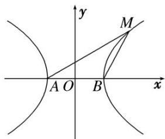

> [!faq]- 教师版例题解析
>
> > [!success]- **【答案】** D
>
> > [!note]- **【分析】**
> > 本题未单列分析。
>
> > [!note]- **【解析】**
> > 答案 D 解析 秒杀 $\because k_{1}\cdot k_{2}=e^{2}-1.\therefore1=e^{2}-1.\therefore e=\sqrt{2}$ . 故选 D.
> > 通法 不妨取点 $M$ 在第一象限，如图所示，设双曲线方程为 $\frac{x^2}{a^2} -\frac{y^2}{b^2} = 1(a > 0,b > 0)$ ，则 $|BM| = |AB| = 2a,$ $\angle MBx = 180^{\circ} - 120^{\circ} = 60^{\circ}$ ， $\therefore M$ 点的坐标为 $(2a, \sqrt{3} a)$ . $\because M$ 点在双曲线上， $\therefore \frac{4a^2}{a^2} - \frac{3a^2}{b^2} = 1$ ， $a = b$ ， $\therefore c = \sqrt{2} a$ ， $e = \frac{c}{a} = \sqrt{2}$ 故选D.
> > 
