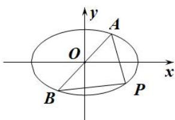
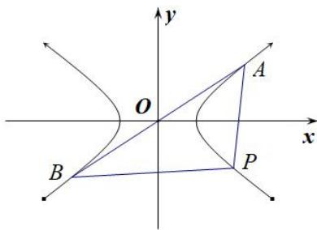

## 第III组秒杀公式

(1)若直线 $y = kx$ 与椭圆 $E$ 交于 $A, B$ 两点， $P$ 为椭圆上异于 $A, B$ 的点，若直线 $PA, PB$ 的斜率存在，且分别为 $k_{1}, k_{2}$ ，则 $k_{1} \cdot k_{2} = -\frac{b^{2}}{a^{2}} = e^{2} - 1$ .

(2)若直线 y=kx 与双曲线 E 交于 A, B 两点，P 为双曲线上异于 A, B 的点，若直线 PA, PB 的斜率存在，且分别为 $k_{1}$ ， $k_{2}$ ，则 $k_{1}\cdot k_{2}=\frac{b^{2}}{a^{2}}=e^{2}-1$ .

注：当焦点在 $y$ 轴上时 $a, b$ 对调.

![[高中/总复习/专题/圆锥曲线/专题01 5组秒杀公式模型-圆锥曲线/专题01_五组秒杀公式模型/第III组秒杀公式/例题选讲/例题选讲.md]]
![[高中/总复习/专题/圆锥曲线/专题01 5组秒杀公式模型-圆锥曲线/专题01_五组秒杀公式模型/第III组秒杀公式/对点训练/对点训练.md]]
