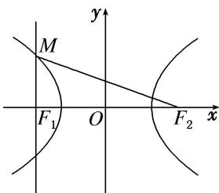

> [!faq]- 教师版例题解析
>
> > [!success]- **【答案】** A
>
> > [!note]- **【分析】**
> > 本题未单列分析。
>
> > [!note]- **【解析】**
> > 答案 A 解析 秒杀 作出示意图,如图,离心率 $e = \frac{c}{a} = \frac{2c}{2a} = \frac{|F_1F_2|}{|MF_2| - |MF_1|} = \frac{\sin\angle F_1MF_2}{\sin\angle MF_1F_2 - \sin\angle MF_2F_1}$ $= \frac{\frac{2\sqrt{2}}{3}}{1 - \frac{1}{3}} = \sqrt{2}$ . 故选 A.
> > 
> > 通法 因为 $MF_{1}$ 与 x 轴垂直，所以 $\left|MF_{1}\right|=\frac{b^{2}}{a}$ . 又 $\sin\angle MF_{2}F_{1}=\frac{1}{3}$ ，所以 $\frac{\left|MF_{1}\right|}{\left|MF_{2}\right|}=\frac{1}{3}$ ，即 $\left|MF_{2}\right|=3\left|MF_{1}\right|$ . 由双曲线的定义，得 $2a=\left|MF_{2}\right|-\left|MF_{1}\right|=2\left|MF_{1}\right|=\frac{2b^{2}}{a}$ ，所以 $b^{2}=a^{2}$ ，所以 $c^{2}=b^{2}+a^{2}=2a^{2}$ ，所以离心率 $e=\frac{c}{a}=\sqrt{2}$ .
> >
> > 故选 **A**.
