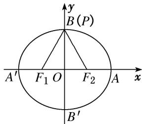

> [!faq]- 教师版例题解析
>
> > [!success]- **【答案】** 详见解析
>
> > [!note]- **【分析】**
> > 本题未单列分析。
>
> > [!note]- **【解析】**
> > 答案 $\frac{1}{2}$ 解析 秒杀 $e = \frac{c}{a} = \frac{2c}{2a} = \frac{|F_1F_2|}{|PF_2| + |PF_1|} = \frac{1}{2}$
> > 通法 如图所示，当点 P 与点 B 重合时， $\angle F_{1}PF_{2}$ 取得最大值 $60^{\circ}$ ，此时 $|OF_{1}|=c,\quad|PF_{1}|=|PF_{2}|=2c$ 。由椭圆的定义，得 $|PF_{1}|+|PF_{2}|=4c=2a$ ，所以椭圆的离心率 $e=\frac{c}{a}=\frac{1}{2}$ 。
> > 
