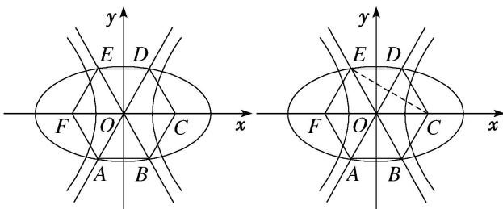

> [!faq]- 教师版例题解析
>
> > [!success]- **【答案】** 详见解析
>
> > [!note]- **【分析】**
> > 本题未单列分析。
>
> > [!note]- **【解析】**
> > 答案 $\sqrt{3} - 1$ 2 解析 秒杀 双曲线 $N$ 的离心率 $e_1 = \sqrt{1 + \tan^2 60^\circ} = 2$ 。椭圆 $M$ 的离心率 $e_2 = \frac{\sin \angle FDC}{\sin \angle DFC + \sin \angle DCF} = \frac{\sin 90^\circ}{\sin 30^\circ + \sin 60^\circ} = \sqrt{3} - 1$ .
> > 通法一：如图，∵双曲线N的渐近线方程为 $y=\pm\frac{n}{m}x,\quad\therefore\frac{n}{m}=\tan60^{\circ}=\sqrt{3},\quad\therefore$ 双曲线N的离心率 $e_{1}$ 满足 $e_{1}^{2}=1+\frac{n^{2}}{m^{2}}=4,\quad\therefore e_{1}=2.$ 由 $\left\{\begin{aligned}y&=\sqrt{3}x,\\ \frac{x^{2}}{a^{2}}+\frac{y^{2}}{b^{2}}=1,\end{aligned}\right.$ 得 $x^{2}=\frac{a^{2}b^{2}}{3a^{2}+b^{2}}.$ 设D点的横坐标为x，由正六边形的性质得 $|ED|=2x=c,\quad\therefore4x^{2}=c^{2}.$ $\therefore\frac{4a^{2}b^{2}}{3a^{2}+b^{2}}=a^{2}-b^{2},$ 得 $3a^{4}-6a^{2}b^{2}-b^{4}=0,\quad\therefore3-\frac{6b^{2}}{a^{2}}-\left(\frac{b^{2}}{a^{2}}\right)^{2}=0,$ 解得 $\frac{b^{2}}{a^{2}}=2\sqrt{3}-3.$ ∴椭圆M的离心率 $e_{2}^{2}=1-\frac{b^{2}}{a^{2}}=4-2\sqrt{3}.$ ∴ $e_{2}=\sqrt{3}-1.$
> > 
> > 通法二：∵双曲线 N 的渐近线方程为 $y=\pm\frac{n}{m}x$ ，则 $\frac{n}{m}=\tan60^{\circ}=\sqrt{3}$ 。又 $c_{1}=\sqrt{m^{2}+n^{2}}=2m$ ，∴双曲线 N 的离心率为 $\frac{c_{1}}{m}=2$ 。如图，连接 EC，由题意知，F，C 为椭圆 M 的两焦点，设正六边形边长为 1，则 $|FC|=2c_{2}=2$ ，即 $c_{2}=1$ 。又 E 为椭圆 M 上一点，则 $|EF|+|EC|=2a$ ，即 $1+\sqrt{3}=2a$ ， $a=\frac{1+\sqrt{3}}{2}$ 。∴椭圆 M 的离心率为 $\frac{c_{2}}{a}=\frac{2}{1+\sqrt{3}}=\sqrt{3}-1$ 。
