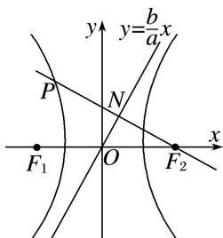

> [!faq]- 教师版对点训练解析
>
> > [!success]- **【答案】** C
>
> > [!note]- **【分析】**
> > 本题未单列分析。
>
> > [!note]- **【解析】**
> > 答案 C 解析 秒杀 由已知 $\triangle F_{1}PF_{2}$ 是直角三角形， $\angle F_{2}PF_{1}=90^{\circ}$ ， $\sin\angle PF_{1}F_{2}=\frac{b}{c}$ ， $\angle PF_{2}F_{1}=\frac{a}{c}$ ， $\therefore e=\frac{c}{a}=\frac{\sin90^{\circ}}{|\sin\angle PF_{1}F_{2}+\sin\angle PF_{2}F_{1}|}=\frac{1}{\left|\frac{b}{c}-\frac{a}{c}\right|}$ . 即 $\frac{b}{a}=2$ ，所以 $e=\sqrt{1+\left(\frac{b}{a}\right)^{2}}=\sqrt{5}$ . 故选 C.
> > 
> > 通法 如图, 直线 $PF_{2}$ 的方程为 $y = -\frac{a}{b} (x - c)$ , 设直线 $PF_{2}$ 与直线 $y = \frac{b}{a} x$ 的交点为 $N$ , 易知 $N\left(\frac{a^2}{c}, \frac{ab}{c}\right)$ . 又线段 $PF_{2}$ 的中点为 $N$ , 所以 $P\left(\frac{2a^2 - c^2}{c}, \frac{2ab}{c}\right)$ . 因为点 $P$ 在双曲线 $C$ 上, 所以 $\frac{(2a^2 - c^2)^2}{a^2c^2} - \frac{4a^2b^2}{c^2b^2} = 1$ , 即 $5a^2$
> > $= c^{2}$ ，所以 $e = \frac{c}{a} = \sqrt{5}$
> >
> > 故选 **C**.
