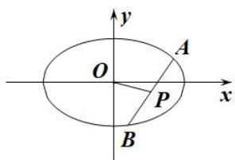
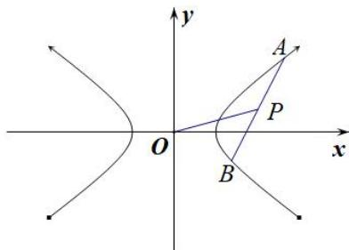

## 第IV组秒杀公式

(1)若直线 $y = kx + m (k \neq 0 \text{且} m \neq 0)$ 与椭圆 $E$ 交于 $A, B$ 两点， $P$ 为弦 $AB$ 的中点，设直线 $PO$ 的斜率为 $k_0$ ，则 $k_0 \cdot k = -\frac{b^2}{a^2} = e^2 - 1$ .

(2)若直线 $y = kx + m (k \neq 0 \text{且} m \neq 0)$ 与双曲线 $E$ 交于 $A, B$ 两点， $P$ 为弦 $AB$ 的中点，设直线 $PO$ 的斜率为 $k_0$ ，则 $k_0 \cdot k = \frac{b^2}{a^2} = e^2 - 1$ .

注：当焦点在 y 轴上时 a, b 对调.

![[高中/总复习/专题/圆锥曲线/专题01 5组秒杀公式模型-圆锥曲线/专题01_五组秒杀公式模型/第IV组秒杀公式/例题选讲/例题选讲.md]]
