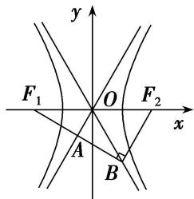
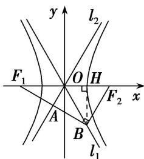

> [!faq]- 教师版例题解析
>
> > [!success]- **【答案】** 详见解析
>
> > [!note]- **【分析】**
> > 本题未单列分析。
>
> > [!note]- **【解析】**
> > 答案 2 解析 秒杀 由 $\overrightarrow{F_{1}A}=\overrightarrow{AB}$ ，得 A 为 $F_{1}B$ 的中点。又∵O 为 $F_{1}F_{2}$ 的中点，∴ $OA \parallel BF_{2}$ 。又 $\overrightarrow{F_{1}B}\cdot\overrightarrow{F_{2}B}=0$ ，∴ $\angle F_{1}BF_{2}=90^{\circ}$ 。∴ $OF_{2}=OB$ ，∴ $\angle OBF_{2}=\angle OF_{2}B$ 。又∵ $\angle F_{1}OA=\angle BOF_{2}$ ， $\angle F_{1}OA=\angle OF_{2}B$ ，∴ $\angle BOF_{2}=\angle OF_{2}B=\angle OBF_{2}$ ，∴ $\triangle OBF_{2}$ 为等边三角形。∴一条渐近线的倾斜角为 $60^{\circ}$ ，斜率为 $\sqrt{3}$ 。∴ $e=\sqrt{1+k^{2}}=2$ 。
> > 通法一：由 $\overrightarrow{F_1A} = \overrightarrow{AB}$ ，得 $A$ 为 $F_{1}B$ 的中点。又 $\because O$ 为 $F_{1}F_{2}$ 的中点， $\therefore OA \parallel BF_{2}$ 。又 $\overrightarrow{F_1B} \cdot \overrightarrow{F_2B} = 0$ ， $\therefore \angle F_{1}BF_{2} = 90^{\circ}$ 。 $\therefore OF_{2} = OB$ ， $\therefore \angle OBF_{2} = \angle OF_{2}B$ 。又 $\because \angle F_{1}OA = \angle BOF_{2}$ ， $\angle F_{1}OA = \angle OF_{2}B$ ， $\therefore \angle BOF_{2} = \angle OF_{2}B = \angle OBF_{2}$ ， $\therefore \triangle OBF_{2}$ 为等边三角形。如图所示，不妨设 $B$ 为 $\left[\frac{c}{2}, -\frac{\sqrt{3}}{2} c\right]$ 。 $\because$ 点 $B$ 在直线 $y = -\frac{b}{a} x$ 上， $\therefore \frac{b}{a} = \sqrt{3}$ ， $\therefore$ 离心率 $e = \frac{c}{a} = 2$ 。
> > 
> > 
> > 通法二： $\because \overrightarrow{F_1B} \cdot \overrightarrow{F_2B} = 0, \therefore \angle F_1BF_2 = 90^\circ$ 。在 Rt $\triangle F_1BF_2$ 中， $O$ 为 $F_1F_2$ 的中点， $\therefore |OF_2| = |OB| = c$ 。如图，作 $BH \perp x$ 轴于 $H$ ，由 $l_1$ 为双曲线的渐近线，可得 $\frac{|BH|}{|OH|} = \frac{b}{a}$ ，且 $|BH|^2 + |OH|^2 = |OB|^2 = c^2, \therefore |BH| = b, |OH| = a, \therefore B(a, -b), F_2(c, 0)$ 。又 $\because \overrightarrow{F_1A} = \overrightarrow{AB}, \therefore A$ 为 $F_1B$ 的中点。 $\therefore OA // F_2B, \therefore \frac{b}{a} = \frac{b}{c - a}, \therefore c = 2a, \therefore$ 离心率 $e = \frac{c}{a} = 2$ 。
