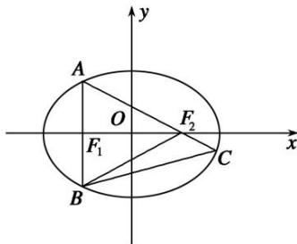

> [!faq]- 教师版例题解析
>
> > [!success]- **【答案】** 详见解析
>
> > [!note]- **【分析】**
> > 本题未单列分析。
>
> > [!note]- **【解析】**
> > 答案 $\frac{\sqrt{5}}{5}$ 解析 秒杀 如图所示，因为 $S_{\triangle ABC} = 3S\triangle_{BCF2}$ ，所以 $|AF_2| = 2|F_2C|$ 。 $\tan \angle F_1F_2A = \frac{b^2}{2ac}$ ，则
> > $\cos^2\angle F_1F_2A = \frac{4a^2c^2}{b^4 + 4a^2c^2}.\quad |e\cos \theta | = \frac{|2 - 1|}{|2 + 1|},$ 即 $\frac{c^2}{a^2}\cdot \frac{4a^2c^2}{b^4 + 4a^2c^2} = \frac{1}{9}$ ，化为： $a^2 = 5c^2$ ，解得 $e = \frac{\sqrt{5}}{5}$
> > 
> > 通法 如图所示，因为 $S_{\triangle ABC}=3S_{\triangle BCF2}$ ，所以 $|AF_{2}|=2|F_{2}C|$ 。 $A(-c,\frac{b^{2}}{a})$ ，直线 $AF_{2}$ 的方程为： $y-0=\frac{\frac{b^{2}}{a}-0}{-c-c}(x-c)$ ，化为： $y=\frac{-b^{2}}{2ac}(x-c)$ ，代入椭圆方程 $\frac{x^{2}}{a^{2}}+\frac{y^{2}}{b^{2}}=1(a>b>0)$ ，可得： $(4c^{2}+b^{2})x^{2}-2cb^{2}x+b^{2}c^{2}-4a^{2}c^{2}=0$ ，所以 $x_{C}(-c)=\frac{b^{2}c^{2}-4a^{2}c^{2}}{4c^{2}+b^{2}}$ ，解得 $x_{C}=\frac{4a^{2}c-b^{2}c}{4c^{2}+b^{2}}$ 。因为 $\overrightarrow{AF}_{2}=2\overrightarrow{F}_{2}C$ ，所以 $c-(-c)=2(\frac{4a^{2}c-b^{2}c}{4c^{2}+b^{2}}-c)$ ，化为： $a^{2}=5c^{2}$ ，解得 $e=\frac{\sqrt{5}}{5}$ 。
