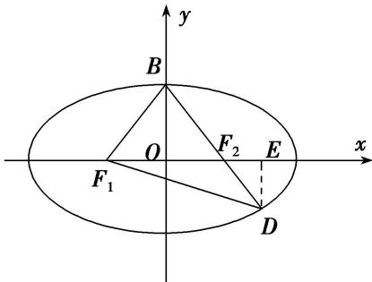

> [!faq]- 教师版对点训练解析
>
> > [!success]- **【答案】** 详见解析
>
> > [!note]- **【分析】**
> > 本题未单列分析。
>
> > [!note]- **【解析】**
> > 答案 $\frac{\sqrt{3}}{3}$ 解析 秒杀 如图，不妨设点 $B$ 是椭圆短轴的上端点，则点 $D$ 在第四象限内，设点 $D(x, y)$ 。由题意得 $\triangle F_{1}BD$ 为等腰三角形，且 $|DF_{1}| = |DB|$ 。由椭圆的定义得 $|DF_{1}| + |DF_{2}| = 2a$ ， $|BF_{1}| = |BF_{2}| = a$ ，又 $|DF_{1}| = |DB| = |DF_{2}| + |BF_{2}| = |DF_{2}| + a$ ， $\therefore (|DF_{2}| + a) + |DF_{2}| = 2a$ ，解得 $|DF_{2}| = \frac{a}{2}$ 。由题可知， $|e\cos \theta| = \frac{|2 - 1|}{|2 + 1|}$ ，即 $|e \cdot \frac{c}{a}| = \frac{|2 - 1|}{|2 + 1|}$ ，所以 $e = \frac{\sqrt{3}}{3}$ 。
> > 通法 如图, 不妨设点 $B$ 是椭圆短轴的上端点, 则点 $D$ 在第四象限内, 设点 $D(x, y)$ . 由题意得 $\triangle F_{1}BD$
> > 为等腰三角形，且 $|DF_{1}|=|DB|$ .
> > 
> > 由椭圆的定义得 $|DF_{1}|+|DF_{2}|=2a,\quad|BF_{1}|=|BF_{2}|=a$ ，又 $|DF_{1}|=|DB|=|DF_{2}|+|BF_{2}|=|DF_{2}|+a,\quad\therefore(|DF_{2}|+a)+|DF_{2}|=2a$ ，解得 $|DF_{2}|=\frac{a}{2}$ 。作 $DE\perp x$ 轴于E，则有 $|DE|=|DF_{2}|\sin\angle DF_{2}E=|DF_{2}|\sin\angle BF_{2}O=\frac{a}{2}\times\frac{b}{a}=\frac{b}{2},\quad|F_{2}E|=|DF_{2}|\cos\angle DF_{2}E=|DF_{2}|\cos\angle BF_{2}O=\frac{a}{2}\times\frac{c}{a}=\frac{c}{2},\quad\therefore|OE|=|OF_{2}|+|F_{2}E|=c+\frac{c}{2}=\frac{3c}{2},\quad\therefore$ 点D的坐标为 $\left(\frac{3c}{2},-\frac{b}{2}\right)$ 。又点D在椭圆上， $\therefore\frac{\left(\frac{3c}{2}\right)^{2}}{a^{2}}+\frac{\left(-\frac{b}{2}\right)^{2}}{b^{2}}=1$ ，整理得 $3c^{2}=a^{2}$ ，所以 $e=\frac{c}{a}=\frac{\sqrt{3}}{3}$ 。
