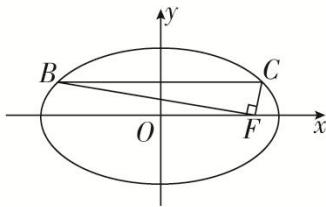

<!-- question-source:start -->
(30)(2016·江苏)如图, 在平面直角坐标系 $xOy$ 中, $F$ 是椭圆 $\frac{x^2}{a^2} +\frac{y^2}{b^2} = 1(a > b > 0)$ 的右焦点, 直线 $y = \frac{b}{2}$ 与椭圆交于 $B$ , $C$ 两点, 且 $\angle BFC = 90^\circ$ , 则该椭圆的离心率是 \_\_\_\_.

<!-- question-source:end -->

![[高中/总复习/专题/圆锥曲线/专题02 建立f(a，b，c)＝0模型-圆锥曲线/专题02_建立f_a_b_c__0模型/1___f_a__b__c__0__型_明显_/例题选讲/例题/answers/Q00033006A1.md]]
