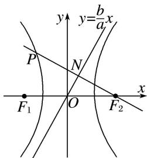

> [!faq]- 教师版对点训练解析
>
> > [!success]- **【答案】** C
>
> > [!note]- **【分析】**
> > 本题未单列分析。
>
> > [!note]- **【解析】**
> > 答案 C 解析 如图，
> > 
> > 直线 $PF_{2}$ 的方程为 $y=-\frac{a}{b}(x-c)$ ，设直线 $PF_{2}$ 与直线 $y=\frac{b}{a}x$ 的交点为 N，易知 $N\left(\frac{a^{2}}{c},\frac{ab}{c}\right)$ 。又线段 $PF_{2}$ 的中点为 N，所以 $P\left(\frac{2a^{2}-c^{2}}{c},\frac{2ab}{c}\right)$ 。因为点 P 在双曲线 C 上，所以 $\frac{(2a^{2}-c^{2})^{2}}{a^{2}c^{2}}-\frac{4a^{2}b^{2}}{c^{2}b^{2}}=1$ ，即 $5a^{2}=c^{2}$ ，所以 $e=\frac{c}{a}=\sqrt{5}$ 。
> >
> > 故选 **C**。
