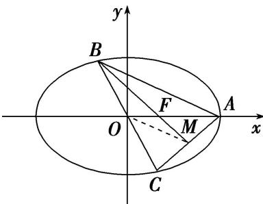

> [!faq]- 教师版例题解析
>
> > [!success]- **【答案】** B
>
> > [!note]- **【分析】**
> > 本题未单列分析。
>
> > [!note]- **【解析】**
> > 答案 B 解析 如图，设点 M 为 AC 的中点，连接 OM，则 OM 为 $\triangle ABC$ 的中位线，于是 $\triangle OFM \sim \triangle AFB$ ，且 $\frac{|OF|}{|FA|} = \frac{|OM|}{|AB|} = \frac{1}{2}$ ，即 $\frac{c}{a - c} = \frac{1}{2}$ ，解得 $e = \frac{c}{a} = \frac{1}{3}$ 。故选 B.
> > 
